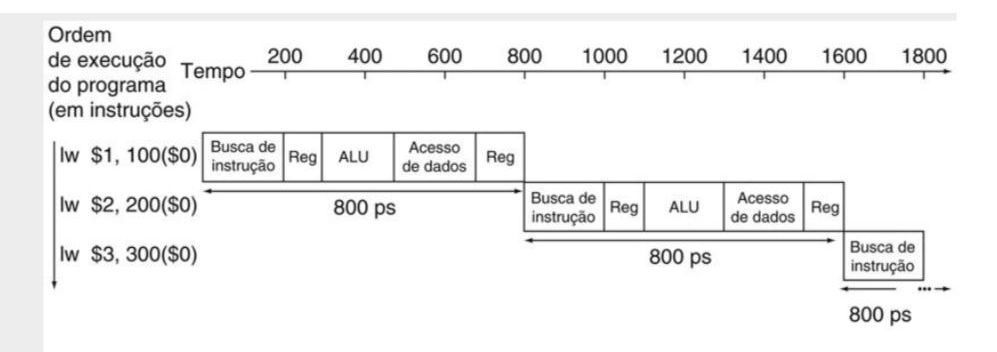
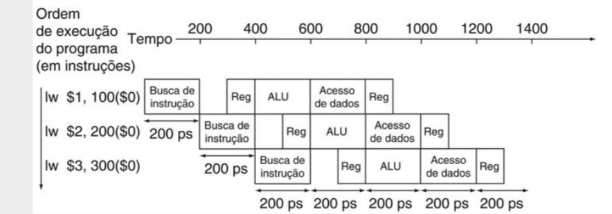
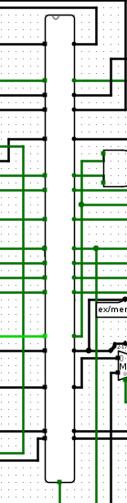
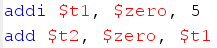
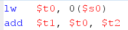

<h1 style='text-align: center'>Processador MIPS com pipelines e contenção de hazards</h1>

André Lucas de Souza Lima  
Kayky Moreira Morais  
Ciência da Computação - Universidade Federal do Cariri  
Desenvolvido na disciplina de Arquitetura e Organização de Computadores  
Instruído pelo docente Ramon Santos Nepomuceno   

<h2>Do que se trata</h2>

Este projeto se trata de um processador do tipo MIPS implementado no software Logisim, em que há o uso da técnica de pipelining para acelerar a execução de instruções e contenções forwarding e stalling para impedir hazards de dados.

Além disso, serão especificadas exemplos de instruções que precisaram ser modificadas para funcionarem corretamente no ambiente de pipelining.

<h3>O que é o pipelining?</h3>

Em um processador MIPS tradicional, as funções seguem o fluxo intuitivo de execução: a primeira se inicia, é encerrada, e então a próxima é processada, seguindo esse funcionamento até o fim.

Graficamente, parece-se com a imagem abaixo:

Com o tempo, desenvolvedores de hardware perceberam que o tempo de execução poderia ser acelerado.

Para que isso acontecesse, uma solução foi inventada: seriam implementadas estruturas chamadas "pipelines" que, em essência, são registradores distribuidos pelo circuito que "prendem" as informações de cada instrução e, após o próximo ciclo de clock, liberam elas para o próximo pipeline,

Dessa maneira, uma instrução não precisa esperar pelo final da anterior, e sim pelo ciclo posterior, que acontece antes do final da primeira.

Com essas mudanças, o diagrama de tempo de execução fica mais próximo com a representação a seguir:

Como visto, a espera total para o fim do programa é reduzida consideravelmente.

Abaixo, a imagem de um pipeline feito no Logisim:

Contudo, essa implementação gera alguns problemas a serem resolvido. Aqui, iremos tratar de um desses: os hazards de dados.

<h3>O que são os hazards de dados?</h3>

Em certas sequências de códigos a serem executados, pode ser que haja a ocasião em que um dado precise ser utilizado por uma instrução sem que ele tenha sido escrito pela anterior. 

Para exemplificar, o código abaixo possui um hazard do tipo citado.

Durante a primeira linha, escreve-se o valor 5 no registrador $t1 e a segunda instrução necessita dele para inserir o mesmo valor no registrador $t2.

Porém, como a segunda instrução é executada sem que a primeira seja terminada, o valor contido no registrador não está atualizado para 5, o que revela um hazard.

Além do tipo acima, há uma segunda ocorrência que se desenrola quando uma instrução tenta buscar um dado que ainda não está pronto por estar sendo preparado por outra.

O hazard mencionado pode ser visto na próxima figura:

Aqui, a primeira linha guarda, no registrador $t0, o valor armazenado no endereço contido em $s0 e a instrução seguinte precisa dele para salvar um número em $t1.

Todavia, a informação ainda não está pronta pois a segunda linha utiliza o valor em um estado anterior ao da primeira.

Ambas formas de hazard devem ser corrigidas, respectivamente, por forwarding e stalling, técnicas específicas que serão destrinchadas a seguir.

<h2>Instruções modificadas</h2>

<h2>Testes</h2>

