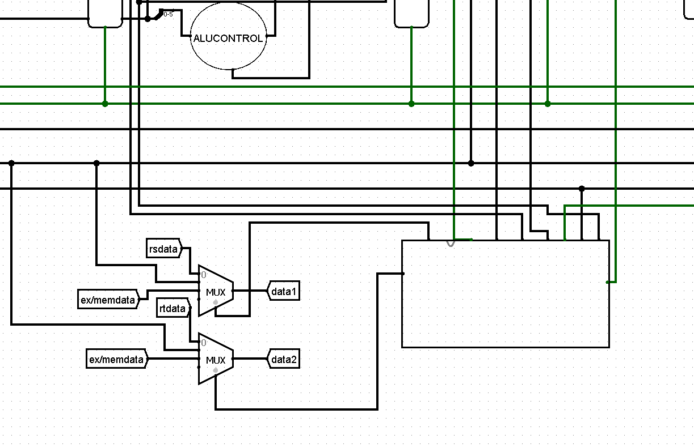
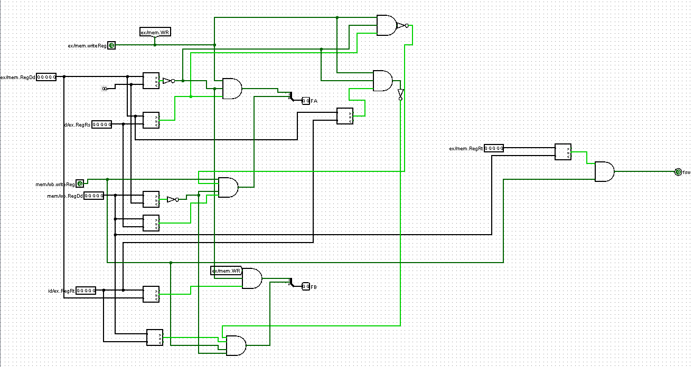
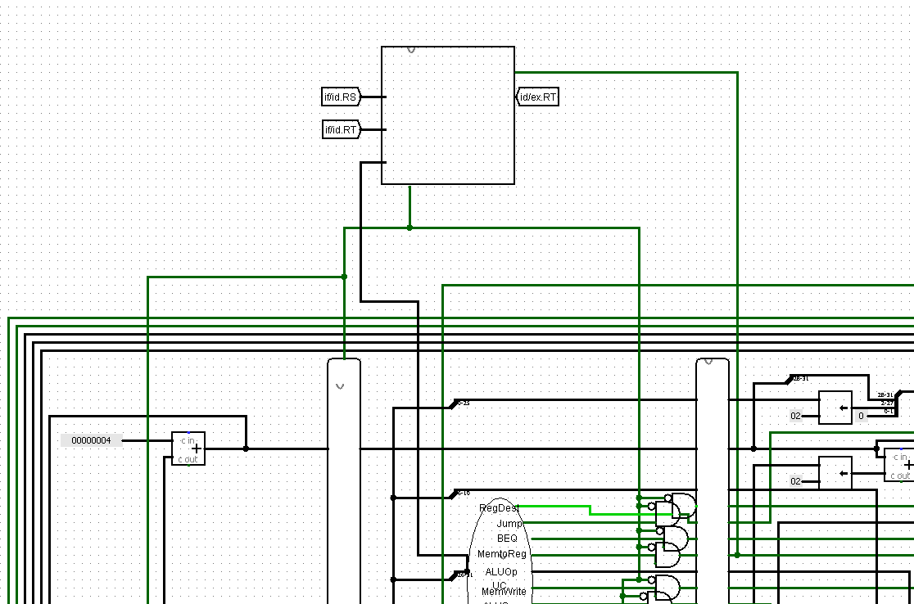
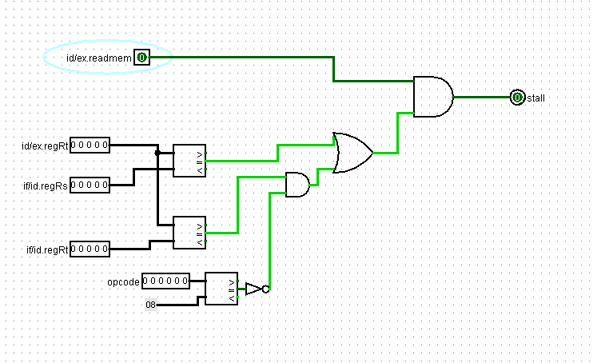

# Processador MIPS com pipelines e contenção de hazards

André Lucas de Souza Lima  
Kayky Moreira Morais  
Ciência da Computação - Universidade Federal do Cariri  
Desenvolvido na disciplina de Arquitetura e Organização de Computadores  
Instruído pelo docente Ramon Santos Nepomuceno

## Do que se trata

Este projeto se trata de um processador do tipo MIPS implementado no software Logisim, em que há o uso da técnica de pipelining para acelerar a execução de instruções e contenções forwarding e stalling para impedir hazards de dados.

Além disso, serão especificadas exemplos de instruções que precisaram ser modificadas para funcionarem corretamente no ambiente de pipelining.

## Como instalar o Logisim

A forma mais rápida e segura de instalar o Logisim é pelo site SourceForge, conhecido por disponibilizar downloads em uma plataforma sólida.

Ao acessar este <a href="https://sourceforge.net/projects/circuit/">link</a>, você deve ser redirecionado para a página do Logisim no SourceForge.

A partir disso, basta apenas apertar o botão principal escrito "Download" igual ao a seguir, que transferirá um executável para seu navegador e solicitará um local de armazenamento no computador.

Após isso, o Logisim já estará instalado e pronto para ser executado por meio desse arquivo.

## Instruções modificadas

Primeiramente, serão abordadas certas instruções que precisaram ser alteradas para que pudessem se encaixar no novo processador sem que houvessem erros. São elas:

### Instruções lógicas (AND, OR)

Para adequar as instruções AND e OR do tipo R, foram apenas inseridas duas portas lógicas AND e OR na ULA, de modo que um código com opcode 000000 (tipo R) pode vir usá-las se seu funct for 000100 (AND) ou 000101 (OR).

### Instruções de desvio (BNE, JR, JAL, J)

A instrução BNE foi implementada do mesmo modo da BEQ, em que um sinal BNE é ativado da UC a partir do momento em que se identifica o opcode 001001. E então, espera-se um sinal "igual" negado vindo da ULA para garantir que o salto pode ser feito no caso dos valores vindos de RS e RT forem diferentes.

Caso sejam, o endereço calculado da branch a partir do imediato é passado para o PC, realizando assim o salto.

Abaixo, mostra-se o recebimento do imediato, que é "shiftado" duas vezes à esquerda e somado ao PC+4 para resultar no endereço alvo.

Tal endereço é passado pelo pipeline EX/MEM em direção ao estado MEM, onde é decidido, a partir da verificação anterior, se o endereço será ou não pulado.

Em relação à instrução JR, um sinal é ativo para o caso do opcode ser igual a 001011. Para a decisão do endereço alvo, há um desvio do sinal JR no estado MEM onde, junto com um OR entre ele, um sinal de JUMP e de JR, é decidido que haverá um pulo na memória de instruções.

O endereço sempre virá do registrador RS, que já será um número de 32 bits, então só precisará ser passado pelo pipeline ID/EX, estado EX, pipeline EX/MEM, onde finalmente irá do estado MEM até um multiplexador ligado ao PC, que decidirá entre o PC+4, endereço de JUMP, endereço de BRANCH (BEQ ou BNE) e endereço de JR.

Já para JAL, o opcode 001100 é responsável por identificar a instrução e ativar o sinal JAL vindo da UC. Assim que é ativado, ele é passado diretamente para o pipeline MEM/WB e retorna para as entradas do banco de registradores pois, caso esteja ligado, registrará o valor de PC+4 no registrador 31, como mostrado na figura a seguir:

O JUMP, diferentemente, com um opcode 000110, acenderá um sinal da UC que irá chegar no estado MEM e ser inserido no mesmo OR que as instruções JR e JAL.

O cálculo do endereço, no caso do JAL e JUMP, é dado pelo "shift" de duas casas à esquerda e concatenação dos quatro bits mais significativos do PC+4 aos quatro bits mais significativos do endereço a ser calculado.

### Instruções de Comparação (SLT, SLTI)

Como SLT é uma instrução de tipo R, foi apenas necessária a adição de um sinal de "menor que" na ULA, que compara o registrador RS com RT e funciona com o funct 000110 e opcode 000000.

Caso tal sinal seja verdadeiro, ele é passado estendido para 32 bits ao registrador RD.

Para o caso do SLTI, foi adicionado um opcode próprio de número 001010 que registra uma operação na ULA, a qual utiliza o mesmo artifício citado durante a explicação do SLT, mas comparando o conteúdo do registrador RS com um valor imediato e, caso seja menor, transferindo um número "1" de 32 bits ao registrador RT.

### Instruções de Shift (SLL, SLR)

As instruções SLL e SLR possuem a mesma função, com a única diferença que SLL desloca bits para a esquerda, enquanto SLR, para a direita.

A implmentação de ambos consiste na definição dos opcodes 001101 e 001110, respectivamente, que simplesmente ativam os sinais da UC básicos para qualquer instrução que deseja utilizar operações da ULA sem que seja de tipo R.

É o que acontece com SLL e SLR, que acendem os ALUOPs 10111 e 11000, respectivamente, os quais ativam deslocadores de bits que permitem que essas execuções os utilizem, definindo a quantidade de bits de acordo com o número encontrado no shamt.

É de extrema importância ressaltar que todas as instruções descritas acima que escrevam dados em algum registrador precisam ativar o sinal RegWrite da UC, que será sempre levado de pipeline a pipeline até o estado WB, onde haverá a escrita em si.

Lá, tal sinal dará a permissão no banco de registradores para que o registrador definido por RegDest, também vindo da UC, tenha o seu valor alterado.

## O que é o pipelining?

Em um processador MIPS tradicional, as funções seguem o fluxo intuitivo de execução: a primeira se inicia, é encerrada, e então a próxima é processada, seguindo esse funcionamento até o fim.

Graficamente, parece-se com a imagem abaixo:

Com o tempo, desenvolvedores de hardware perceberam que o tempo de execução poderia ser acelerado.

Para que isso acontecesse, uma solução foi inventada: seriam implementadas estruturas chamadas "pipelines" que, em essência, são registradores distribuidos pelo circuito que "prendem" as informações de cada instrução e, após o próximo ciclo de clock, liberam elas para o próximo pipeline,

Dessa maneira, uma instrução não precisa esperar pelo final da anterior, e sim pelo ciclo posterior, que acontece antes do final da primeira.

Com essas mudanças, o diagrama de tempo de execução fica mais próximo com a representação a seguir:

Como visto, a espera total para o fim do programa é reduzida consideravelmente.

Abaixo, a imagem de um pipeline feito no Logisim:

Contudo, essa implementação gera alguns problemas a serem resolvido. Aqui, iremos tratar de um desses: os hazards de dados.

## O que são os hazards de dados?

Em certas sequências de códigos a serem executados, pode ser que haja a ocasião em que um dado precise ser utilizado por uma instrução sem que ele tenha sido escrito pela anterior. 

Para exemplificar, o código abaixo possui um hazard do tipo citado.

Durante a primeira linha, escreve-se o valor 5 no registrador $t1 e a segunda instrução necessita dele para inserir o mesmo valor no registrador $t2.

Porém, como a segunda instrução é executada sem que a primeira seja terminada, o valor contido no registrador não está atualizado para 5, o que revela um hazard.

Além do tipo acima, há uma segunda ocorrência que se desenrola quando uma instrução tenta buscar um dado que ainda não está pronto por estar sendo preparado por outra.

O hazard mencionado pode ser visto na próxima figura:

Aqui, a primeira linha guarda, no registrador $t0, o valor armazenado no endereço contido em $s0 e a instrução seguinte precisa dele para salvar um número em $t1.

Todavia, a informação ainda não está pronta pois a segunda linha utiliza o valor em um estado anterior ao da primeira.

Ambas formas de hazard devem ser corrigidas, respectivamente, por forwarding e stalling, técnicas específicas que serão destrinchadas a seguir.

## Unidade de fowarding

A unidade de fowarding é responsável por disponibilizar os dados das instruções nos estágios MEM e WB para instruções que estão no estágio EX (ou MEM no caso da instrução sw), prevenindo que as operações sejam realizadas com valores desatualizados. O circuito consiste em 7 sinais de entrada: ex/mem.WR, mem/wb.WR, ex/mem.RD, mem/wb.RD, id/ex.RS, id/ex.RT, e 3 sinais de saída FA, FB e FSW. As saídas são aplicadas em multiplexadores, dependendo do valor de saída, o sinal escolhe entre o que vem do banco de registradores (00), o dado de ex/mem (10), ou o dado de mem/wb (01), já o FSW escolhe o dado atual (0) ou o que se encontra em mem/wb (1).   

A diferença entre FA e FB consiste no registrador ao qual se escolhe, o FA faz o fowarding para o registrador RS enquanto o FB para o RT. A lógica é a mesma:
bit 1: se o sinal ex/mem.WR está aceso, o registrador de destino ex/mem.RD é diferente de 0 e ex/mem.RD é igual ao registrdor id/ex.RS (id.ex/RT), então ocorre fowarding de MEM para EX.
bit 0: se o sinal mem/wb.WR está aceso, o registrador de destino mem/wb.RD é diferente de 0 e mem/wb.RD é igual ao registrdor id/ex.RS (id.ex/RT) e o sinal ex/mem.WR não está aceso ou ex/memRD = 0 ou ex/mem.RD = id/ex.RS(id/ex.RT), então ocorre fowarding do estágio WB para EX. 
A última sentença do bit 0 explica-se paras o caso de modificações em sequência como:  
add $1, $1, $2  
add $1, $1, $3  
add $1, $1, $4  
para que o fowarding retorne o valor mais atualizado.

O fowarding para instrução SW é simples: se o registrador ex/mem.RT = mem/wb.RD e mem/wb.WR está aceso, então ocorre fowarding de WB para MEM. Não é preciso verificar o sinal de escrita na memória pois se ele estiver desabilitado, não há diferença se a condição é verdadeira, pois nada será escrito.

A unidade de hazard é responsável por gerar um stall na sequência de execução caso haja uma instrução lw seguida de outra que dependa de seu valor. A lógica: se id/ex.Memtoreg está aceso e id/ex.RT = if/id.RS ou (id/ex.RT = id/ex.RT e opcode diferente do opcode do sw) então ocorre um stall. O sinal de stall zera todos os outros da unidade de controle (nop) e impede a instrução que está em if/id e pc de passar. O stall não precisa ocorrer no caso de um lw seguido de sw pois a unidade de fowarding consegue levar esse dado a tempo do WB para MEM. Para exemplificar:  
lw $1, 0($sp)  
sw $1, 4($sp) # não ocorre stall  
lw $1, 0($sp)  
sw $2, 4($1) # ocorre stall  
lw $1, 0($sp)  
sw $1, 4($1) # ocorre stall

## Programa teste
Considere o seguinte progama que contém vários hazards de dados e a memória de dados incializada com os valores 7 e 11 nos endereços 0000 e 0001:  
addi $1, $0, 20  
subi $2, $1, 10  
muli $3, $2, 3  
divi $4, $1, 5  
add $5, $4, $4  
sub $6, $3, $5  
mul $7, $5, $5  
div $8, $3, $2  
or $9, $8, $6  
and $10, $9, $9  
sll $11, $2, 3  
slr $12, $11, 2  
slt $13, $12, $11  
slti $14, $13, 100  
lw $15, 0($0)  
add $16, $15, $15  
sw $16, 8($0)  
lw $17, 4($0)  
sw $17, 12($0)  
Cujo código em hexadeciamal é:  
04010014  
0822000a  
0c430003  
10240005  
00842800  
00653001  
00a53802  
00624003  
01064805  
01295004  
344b00c7  
396c0088  
018b6806  
29ae0064  
1c0f0000  
01ef8000  
20100008  
1c110004  
2011000c  
Ao final do programa os seguintes valores devem ser encontrados nos registradores do 1 ao 17 respectivamente:
20, 10, 30, 4, 8, 22, 64, 3, 23, 24, 80, 20, 1, 1, 7, 14 e 11. Na memória de dados, serão carregados nos endereços 0002 e 0003 os valores 14 e 11. 
