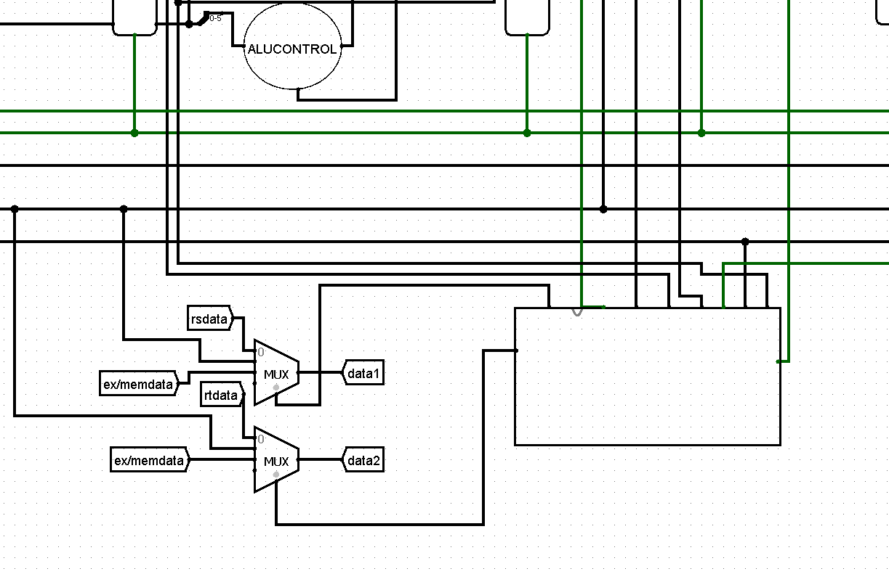
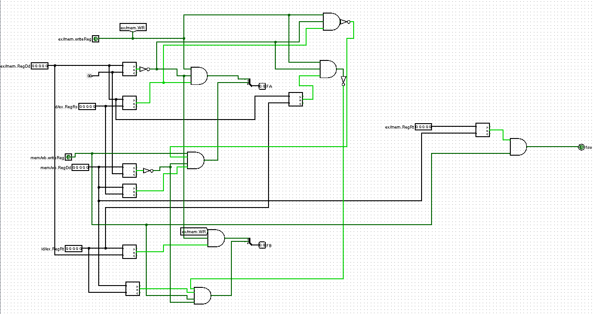
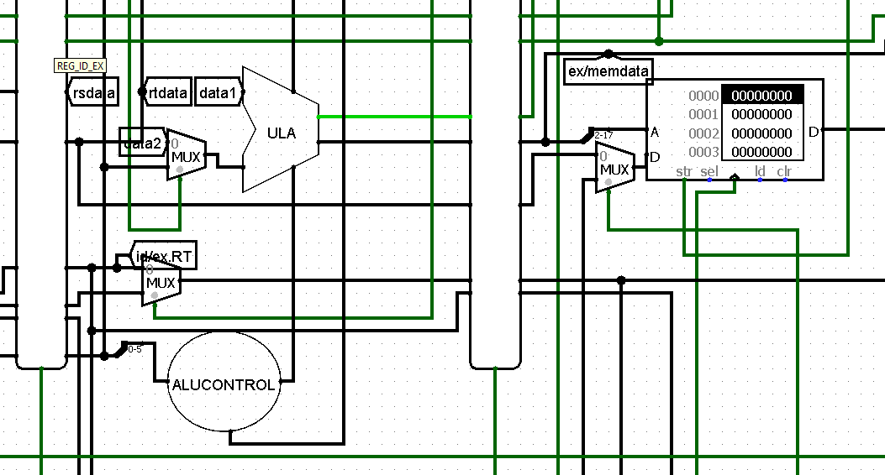
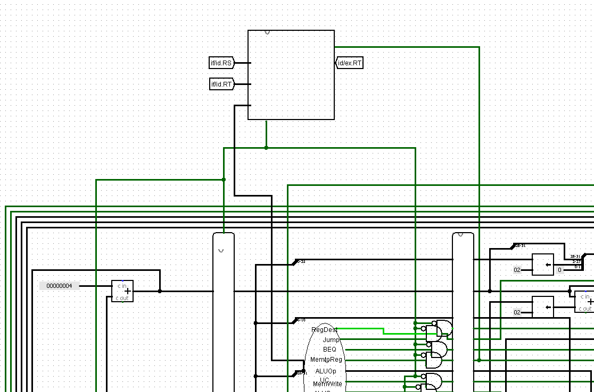
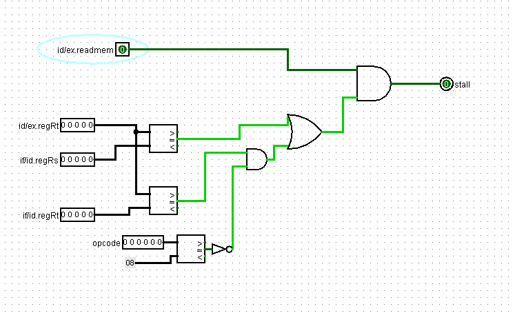

# pipeline-mips
Processador MIPS desenvolvido no Logisim com uso de pipelines e contenção de hazards

# Unidade de fowarding

A unidade de fowarding é responsável por disponibilizar os dados das instruções nos estágios MEM e WB para instruções que estão no estágio EX (ou MEM no caso da instrução sw), prevenindo que as operações sejam realizadas com valores desatualizados. O circuito consiste em 7 sinais de entrada: ex/mem.WR, mem/wb.WR, ex/mem.RD, mem/wb.RD, id/ex.RS, id/ex.RT, e 3 sinais de saída FA, FB e FSW. As saídas são aplicadas em multiplexadores, dependendo do valor de saída, o sinal escolhe entre o que vem do banco de registradores (00), o dado de ex/mem (10), ou o dado de mem/wb (01), já o FSW escolhe o dado atual (0) ou o que se encontra em mem/wb (1).   

A diferença entre FA e FB consiste no registrador ao qual se escolhe, o FA faz o fowarding para o registrador RS enquanto o FB para o RT. A lógica é a mesma:
bit 1: se o sinal ex/mem.WR está aceso, o registrador de destino ex/mem.RD é diferente de 0 e ex/mem.RD é igual ao registrdor id/ex.RS (id.ex/RT), então ocorre fowarding de MEM para EX.
bit 0: se o sinal mem/wb.WR está aceso, o registrador de destino mem/wb.RD é diferente de 0 e mem/wb.RD é igual ao registrdor id/ex.RS (id.ex/RT) e o sinal ex/mem.WR não está aceso ou ex/memRD = 0 ou ex/mem.RD = id/ex.RS(id/ex.RT), então ocorre fowarding do estágio WB para EX. 
A última sentença do bit 0 explica-se paras o caso de modificações em sequência como:
   
add $1, $1, $2 
add $1, $1, $3 
add $1, $1, $4 
para que o fowarding retorne o valor mais atualizado.

O fowarding para instrução SW é simples: se o registrador ex/mem.RT = mem/wb.RD e mem/wb.WR está aceso, então ocorre fowarding de WB para MEM. Não é preciso verificar o sinal de escrita na memória pois se ele estiver desabilitado, não há diferença se a condição é verdadeira, pois nada será escrito.   

A unidade de hazard é responsável por gerar um stall na sequência de execução caso haja uma instrução lw seguida de outra que dependa de seu valor. A lógica: se id/ex.Memtoreg está aceso e id/ex.RT = if/id.RS ou (id/ex.RT = id/ex.RT e opcode diferente do opcode do sw) então ocorre um stall. O sinal de stall zera todos os outros da unidade de controle (nop) e impede a instrução que está em if/id e pc de passar. O stall não precisa ocorrer no caso de um lw seguido de sw pois a unidade de fowarding consegue levar esse dado a tempo do WB para MEM. Para exemplificar:
 
lw $1, 0($sp) 
sw $1, 4($sp) # não ocorre stall 
lw $1, 0($sp) 
sw $2, 4($1) # ocorre stall 
lw $1, 0($sp) 
sw $1, 4($1) # ocorre stall

# Progama teste

  Considere o seguinte progama que contém vários hazards de dados e a memória de dados incializada com os valores 7 e 11 nos endereços 0000 e 0001: 
addi $1, $0, 20 
subi $2, $1, 10 
muli $3, $2, 3 
divi $4, $1, 5 
add $5, $4, $4 
sub $6, $3, $5 
mul $7, $5, $5 
div $8, $3, $2 
or $9, $8, $6 
and $10, $9, $9 
sll $11, $2, 3 
slr $12, $11, 2 
slt $13, $12, $11 
slti $14, $13, 100 
lw $15, 0($0) 
add $16, $15, $15 
sw $16, 8($0) 
lw $17, 4($0) 
sw $17, 12($0) 
  Cujo código em hexadeciamal é: 
04010014 
0822000a 
0c430003 
10240005 
00842800 
00653001 
00a53802 
00624003 
01064805 
01295004 
344b00c7 
396c0088 
018b6806 
29ae0064 
1c0f0000 
01ef8000 
20100008 
1c110004 
2011000c 
Ao final do programa os seguintes valores devem ser encontrados nos registradores do 1 ao 17 respectivamente:
  20, 10, 30, 4, 8, 22, 64, 3, 23, 24, 80, 20, 1, 1, 7, 14 e 11. Na memória de dados, serão carregados nos endereços 0002 e 0003 os valores 14 e 11. 

